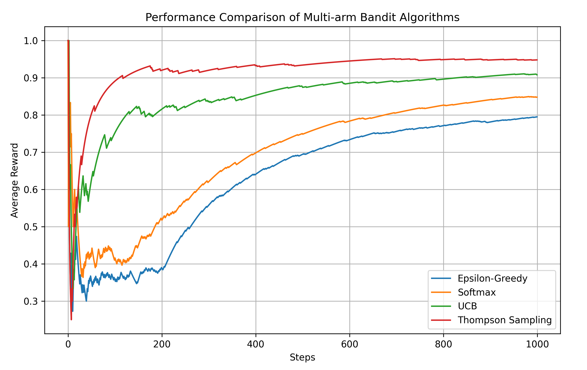

# Bandits
Simplest Multi-arm Bandits, We provide four algorithms to solve the multi-arm bandit problem in one python file (only depend on numpy):

- Value based: epsilon greedy
- Policy based: softmax policy gradient
- UCB: Upper Confidence Bound
- Thompson Sampling: Bayesian approach

