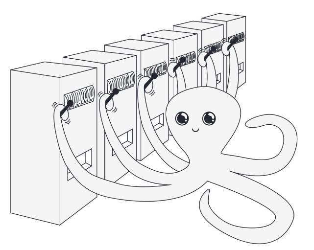
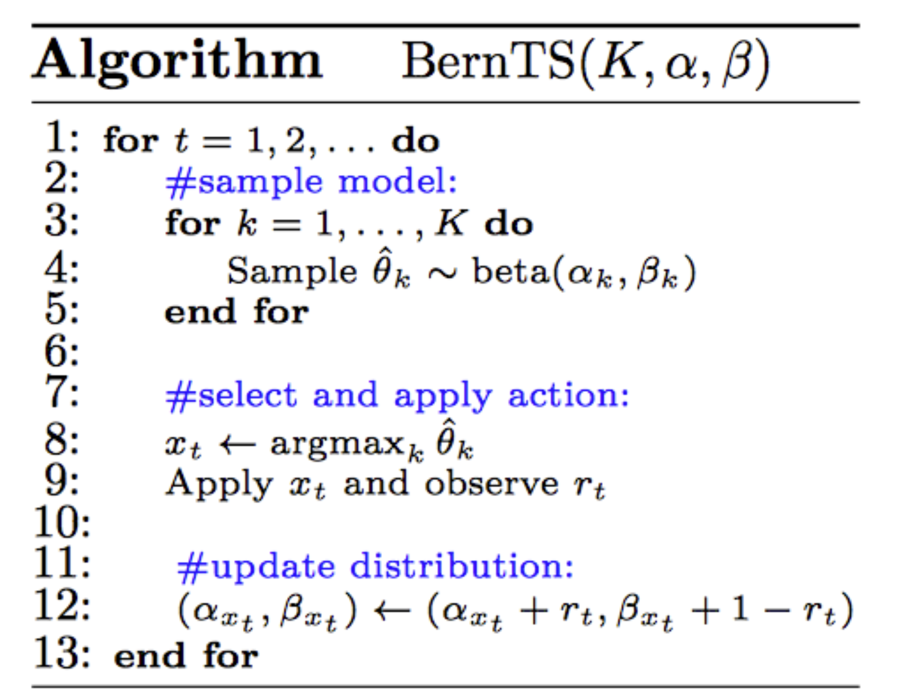
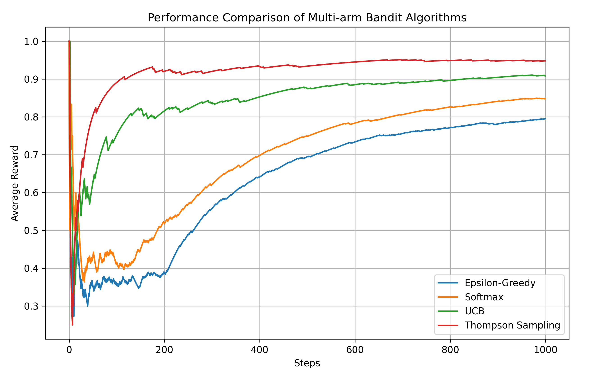

# 从头理解强化学习理想模型：多臂老虎机，Multi-arm bandit

## 1. 多臂老虎机
作为赌场中最受欢迎的赌博机之一，多臂老虎机也深受学术界的宠爱，被统计学，运筹学，电子工程，经济学，计算机科学等多个领域的研究者所关注。这一模型假设简单，容易进行深入的理论分析，且在实际应用中有着广泛的应用场景。在强化学习中，多臂老虎机常常作为一个简化的理想模型而被讨论。

多臂老虎机的基本设定如下：假设总共有$K$个臂（Arm），每个臂$a$都有一个未知的奖励分布（为了简化起见，我们假设奖励服从未知参数$\theta_a$的伯努利分布，当然，也可以是其他更复杂的分布），每次拉动一个臂$a$，我们会得到一个奖励$R$，$R \sim \text{Bernoulli}(\theta_a)$。我们的目标是通过拉动臂来最大化获得的奖励的期望值。多臂老虎机问题是一个探索（Exploration）和利用（Exploitation）之间的权衡问题：在探索阶段，我们需要尝试不同的臂以了解它们的奖励分布；而在利用阶段，我们需要选择当前认为最优的臂以获得最大的奖励。

记$t$时刻的动作为拉动臂$a$，$A_t=a$，$R_t$为奖励，那么臂$a$的价值：
$$
q_*(a) = \mathbb{E}[R_t|A_t=a]  = \theta_a
$$
为我们想要估计的量。策略$\pi_t(a)=\mathbb{P}(A_t=a)$，为$t$时刻选择臂的概率分布。接下来，我们将介绍多臂老虎机的几种常见算法。基于值函数的方法，基于策略的方法，基于UCB的方法以及Thompson Sampling，其中，前三种方法都可以拓展到general的强化学习中。
## 2. 基于值函数的方法
值函数的方法很直接，我们估计每个臂的价值$Q_t(a) \approx q_*(a)$，然后利用$Q_t(a)$来选择臂，有两种策略，greedy和epsilon-greedy。greedy策略是选择当前认为最优的臂，而epsilon-greedy策略是以概率$\epsilon$选择一个随机的臂，以概率$1-\epsilon$选择当前认为最优的臂。

记$R_i$为第$i$次拉动臂$a$的奖励，$Q_t$为拉动臂$a$，$t=N(a)$次的平均奖励，那么：
$$
\begin{aligned}
Q_{t} &= \frac{1}{t} \sum_{i = 1}^{t} R_{i} \\
&= \frac{1}{t} \left( R_{t} + \sum_{i = 1}^{t - 1} R_{i} \right) \\
&= \frac{1}{t} \left( R_{t} + \left( t - 1 \right) \frac{1}{t - 1} \sum_{i = 1}^{t - 1} R_{i} \right) \\
&= \frac{1}{t} \left( R_{t} + \left( t - 1 \right) Q_{t-1} \right) \\
&= \frac{1}{t} \left( R_{t} + t Q_{t-1} - Q_{t-1} \right) \\
&= Q_{t-1} + \frac{1}{t} \left[ R_{t} - Q_{t-1} \right]
\end{aligned}
$$
这样，我们就得到了形如：$\text{NewEstimate} \leftarrow \text{OldEstimate} + \text{StepSize} \left[ \text{Target} - \text{OldEstimate} \right]$的迭代更新公式。同时，立即得到epsilon-greedy算法：
$$
\begin{aligned}
&\text{Initialize, for } a = 1 \text{ to } k \text{:} \\
&\qquad Q(a) \leftarrow 0 \\
&\qquad N(a) \leftarrow 0 \\
\\
&\text{Repeat forever:} \\
&\qquad A \leftarrow \begin{cases}
\arg \max_{a} Q(a) & \text{with probability } 1 - \varepsilon \quad \text{(breaking ties randomly)} \\
\text{a random action} & \text{with probability } \varepsilon
\end{cases} \\
&\qquad R \leftarrow bandit(A) \\
&\qquad N(A) \leftarrow N(A) + 1 \\
&\qquad Q(A) \leftarrow Q(A) + \frac{1}{N(A)} \left[ R - Q(A) \right]
\end{aligned}
$$
## 3. 基于策略的方法
让我们直接从策略的角度出发来解决多臂老虎机问题。用$H(a)$表示臂$a$的偏好参数，我们将策略表示为偏好的softmax形式：
$$
\pi_t(a)=\mathbb{P}(A_t=a) = \frac{e^{H_t(a)}}{\sum_{b=1}^{K} e^{H_t(b)}}
$$
试图最大化的目标函数为：
$$
\mathbb{E}[R_t] = \sum_{b} \pi_t(b) q_*(b) 
$$
我们计算目标对偏好的梯度（偏导数）：
$$
\begin{aligned}
\frac{\partial \mathbb{E}[R_{t}]}{\partial H_{t}(a)} &= \frac{\partial}{\partial H_{t}(a)} \left[ \sum_{b} \pi_{t}(b) q_{*}(b) \right] \\
&= \sum_{b} q_{*}(b) \frac{\partial \pi_{t}(b)}{\partial H_{t}(a)}  \\
&= \sum_{b} (q_{*}(b) - X_{t}) \frac{\partial \pi_{t}(b)}{\partial H_{t}(a)}  & \scriptstyle{\text{; Because } \sum_{b} \frac{\partial \pi_{t}(b)}{\partial H_{t}(a)} = \frac{\partial \sum_{b} \pi_{t}(b)}{\partial H_{t}(a)} = 0} \\
&= \sum_{b} \pi_{t}(b) (q_{*}(b) - X_{t}) \frac{\partial \pi_{t}(b)}{\partial H_{t}(a)} / \pi_{t}(b)  \\
&= \mathbb{E} \left[ \left( q_{*}(A_{t}) - X_{t} \right) \frac{\partial \pi_{t}(A_{t})}{\partial H_{t}(a)} / \pi_{t}(A_{t}) \right]  & \scriptstyle{\text{; Let } X_{t} = \bar{R}_{t},\qquad A_t \sim \pi_t(b)}\\
&= \mathbb{E} \left[ \left( R_{t} - \bar{R}_{t} \right) \frac{\partial \pi_{t}(A_{t})}{\partial H_{t}(a)} / \pi_{t}(A_{t}) \right] & \scriptstyle{\text{; Because }\mathbb{E}[R_{t} | A_{t}] = q_{*}(A_{t})}\\
&= \mathbb{E} \left[ (R_{t} - \bar{R}_{t}) \left( \mathbf{1}_{a=A_{t}} - \pi_{t}(a) \right) \right] & \scriptstyle{ ;\frac{\partial \pi_{t}(A_{t})}{\partial H_{t}(a)} / \pi_{t}(A_{t})=\frac{\partial \log\pi_{t}(A_{t})}{\partial H_{t}(a)} = \mathbf{1}_{a = A_{t}} - \pi_{t}(a)} \\ 
\end{aligned}
$$
其中，第三行我们引入了baseline: $X_t$，并在后面令其等于 $\bar{R}_{t}$，即，$t$时刻所有臂的平均奖励。最后一行利用了softmax求导的结果。实际上，将上述推导推广到强化学习我们就得到general的[策略梯度算法](https://zhuanlan.zhihu.com/p/17619447062)。

根据上式，我们可以得到更新偏好的梯度上升公式。在$t$时刻，依据策略$\pi_t$选择臂$A_t$，获得奖励$R_t$，更新每个臂的偏好参数：
$$
H_{t+1}(a) = H_{t}(a) + \alpha (R_{t} - \bar{R}_{t}) (\mathbf{1}_{a=A_{t}} - \pi_{t}(a)) \qquad \forall a
$$
## 4. Upper Confidence Bound (UCB)
首先，我们回顾下霍夫丁不等式（Hoeffding's inequality），令$X_1, X_2, \cdots, X_n$为独立同分布的随机变量, $S_n = X_1 + \cdots + X_n$，且$X_i \in [0, 1]$，则对任意$\epsilon > 0$，有：
$$
\text{Pr}(|\frac{S_n}{n}- \mathbb{E}[X]| \geq \epsilon) \leq 2e^{-2n\epsilon^2}
$$
即：
$$
\text{Pr}(|\mathbb{E}[X] - \frac{S_n}{n}| \leq \epsilon) \geq 1 - 2e^{-2n\epsilon^2}
$$
令$\gamma = 2e^{-2n\epsilon^2}$，则$\epsilon = \sqrt{\frac{\log(1/\gamma)}{2n}}$，$\mathbb{E}[X]$的置信区间 （$1-\gamma$概率）为：
$$
[\frac{S_n}{n} - \sqrt{\frac{\log(1/\gamma)}{2n}}, \frac{S_n}{n} + \sqrt{\frac{\log(1/\gamma)}{2n}}]
$$
代入多臂老虎机，设我们使用了第$a$个臂$N(a)=n$次，$\theta_a$的估计值即为$\frac{S_n}{n}$，记为$Q(a)$，所有臂的使用次数为$T$，令$1/\gamma = T^\alpha$, 则$\theta_a$的置信区间为：
$$
[Q(a) - \sqrt{\frac{\alpha\log(T)}{2N(a)}}, Q(a) + \sqrt{\frac{\alpha\log(T)}{2N(a)}}]
$$
UCB算法选择置信区间上界最大的臂，即：
$$
a^* 
= \arg\max_a \left\{Q(a) + \sqrt{\frac{\alpha\log(T)}{2N(a)}}\right\}
$$
可以看出，UCB算法在面对不确定性时采用了一种乐观的策略（以置信区间的上界作为选择依据），具体来讲，$Q(a)$表示利用exploitation的部分，$\sqrt{\frac{\alpha\log(T)}{2N(a)}}$表示探索Exploration的部分，使用次数$N(a)$越小则这项越大，$\alpha$是超参数来权衡两者。

可以证明，UCB算法的后悔界（Regret Bound）为$O(\log(T))$，即在$T$次操作后，UCB算法与上帝视角最优累积奖励（总是选择$\theta_a$最大的那个臂）之间的差距期望不会超过$O(\log(T))$，为理论最优。
## 5. Thompson Sampling
我们简要介绍下Thompson Sampling算法。如同之前一样，假设总共有$K$个臂，第$k$个臂的奖励服从未知参数$\theta_k$的伯努利分布，$t$时刻，我们拉动臂$x_t$，得到奖励$r_t$，$\mathbb{P}(r_t=1|\theta_{x_t}) = \theta_{x_t}$，$\mathbb{P}(r_t=0|\theta_{x_t}) = 1-\theta_{x_t}$。我们将观测到的奖励另记为数据D，则数据的似然为：
$$
p(D|\theta_{x_t})=\theta_{x_t}^{D} (1-\theta_{x_t})^{1-D}=\theta_{x_t}^{r_t} (1-\theta_{x_t})^{1-r_t}
$$
Thompson Sampling假设参数的先验分布为beta分布，即：
$$
p(\theta_{x_t})=\text{beta}(\alpha_{x_t}, \beta_{x_t}) = \frac{\theta_{x_t}^{\alpha_{x_t}-1} (1-\theta_{x_t})^{\beta_{x_t}-1}}{\frac{\Gamma(\alpha_{x_t}) \Gamma(\beta_{x_t})}{\Gamma(\alpha_{x_t}+\beta_{x_t})}}
$$
根据贝叶斯公式：$p(\theta_{x_t}|D) = \frac{p(D|\theta_{x_t})p(\theta_{x_t})}{p(D)}$，以及[伯努利共轭先验的性质](https://en.wikipedia.org/wiki/Conjugate_prior)，我们可以得到后验分布依然为beta分布：
$$
p(\theta_{x_t}|D) = \text{beta}(\alpha_{x_t}+r_t, \beta_{x_t}+1-r_t)
$$
与此同时，我们立即得到完整的Thompson Sampling算法：

## 6. 代码实现
我们仅仅基于numpy，在一个python文件中实现上述四种bandits算法，并在一张图中比较它们的性能表现，可以看出Thompson Sampling表现最好。